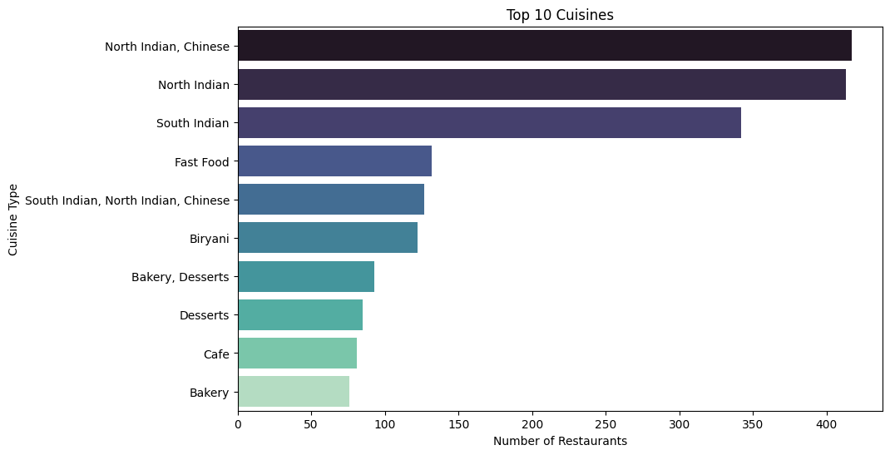
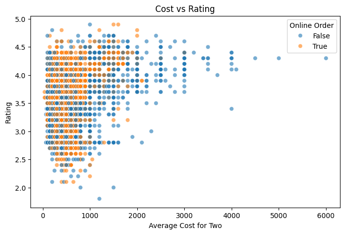

## zomato-restaurant-analysis
This project explores and visualizes Zomato restaurant data to uncover trends in cuisine, pricing, ratings, and delivery. It provides insights into customer preferences and restaurant performance across regions.

## Overview
- Analyzed 9,000+ restaurant records from Zomato
- Focused on cuisines, ratings, pricing, and delivery impact
- Created visualizations using Python, Pandas, and Seaborn
- Extracted actionable insights for restaurants and customers

## Tech Stack
- Python 3
- Pandas
- NumPy
- Matplotlib
- Seaborn
- Jupyter Notebook / Google Colab

## Sample Visualizations
### Top 10 Cuisines

### Price vs Rating

## Key Insights
- **North Indian** and **Chinese** cuisines are most popular.
- Restaurants with **online delivery** tend to have **higher ratings**.
- Areas like **Koramangala** and **BTM** are top hotspots.
- Mid-range restaurants (~₹300–₹600) are the most common.
- Restaurant chains with multiple outlets maintain consistent ratings.

## Files
| File | Description |
| `zomato_analysis.ipynb` | Main analysis notebook |
| `cleaned_zomato.csv` | Cleaned dataset after preprocessing |
| `README.md` | Project summary and documentation |

## Author
**Anshika Sahu**  
LinkedIn: (https://www.linkedin.com/in/anshika-sahu-bbb05224b/)  

